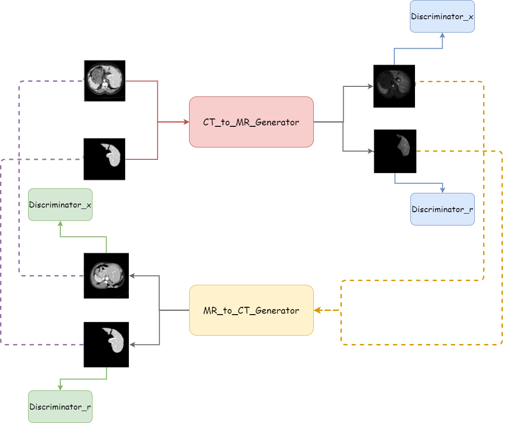

# T2w-MR synthesizing based on CT 

This is my proposed model on translating abdominal slices from CT modality to T2w modality. This implementation is based on my research - *MR image generation from CT image on unpaired data*.

I evaluate my model's performance based on (1) [FID-score](https://arxiv.org/abs/1706.08500) and (2) [DICE](https://en.wikipedia.org/wiki/S%C3%B8rensen%E2%80%93Dice_coefficient) score on downstream segmentation task when augmenting the training data with the MRI synthesised by my model.

On downstream segmentation task (2), I use [nnUNet](https://github.com/MIC-DKFZ/nnUNet/tree/master) to segment liver on MR slices.

<p align="center">

</p>

## Dataset
To download the CHAOS dataset from [the CHAOS challenge website](https://chaos.grand-challenge.org/Download/). 
Then, you need to create a folder's structure like this:

    ├── train
    │   ├── ct
    │   │   ├──1
    │   │   ├──...(patient index)
    │   ├── t1
    │   │   ├──3
    │   │   ├──...(patient index)
    │   ├── t2
    │   │   ├──5
    │   │   ├──...(patient index)
    ├── test
    │   ├── ct
    │   │   ├──2
    │   │   ├──...(patient index)
    │   ├── t1
    │   │   ├──4
    │   │   ├──...(patient index)
    │   ├── t2
    │   │   ├──6
    │   │   ├──...(patient index)

I will also provide my preprocessed dataset [here](https://drive.google.com/uc?export=download&id=19KMwsEAxtW-O3yC2SLN9CQ9cg9cprlsJ).
    
## Installation
```bash
git clone https://github.com/LeTruongVu2k1/MRI-synthesized-from-CT
pip install -r MRI-synthesized-from-CT/requirements.txt
```

## Training
Run the following script:

```bash
python MRI-synthesized-from-CT/train.py -dataset_path <path_to_CHAOS_dataset> \
                                        -model_dir <path_to_model> \
                                        -nnUNet_dir <path_to_nnUNet_folder>
```

Your should prepare `<path_to_CHAOS_dataset>` for training data and create `<path_to_model>` to contain your model during training.

You can just specify `<path_to_CHAOS_dataset>` and `<path_to_model>`. The `<path_to_nnUNet_folder>` will be a directory contain a pretrained nnUNet model for displaying the liver's segmentation on your synthesized-MRI. By default, it will be `MRI-synthesized-from-CT/nnUNet` and contain my [nnUNet-checkpoint](https://drive.google.com/uc?export=download&id=10ViY8pdE1WO139TWONeyZQpbOkNMT4Qy).

For more options, please use the `-h` flag:

```bash
python MRI-synthesized-from-CT/train.py -h
```

**NOTE**: If you want to run on *Colab*, due to this [problem](https://github.com/googlecolab/colabtools/issues/1067), please run like this:

```bash
%run MRI-synthesized-from-CT/train.py -dataset_path <path_to_CHAOS_dataset> \
                                      -model_dir <path_to_model> \
                                      -nnUNet_dir <path_to_nnUNet_folder>
```

## Inference

Run this script to synthesize MRI from your CT:

```bash
python MRI-synthesized-from-CT/inference.py -path <path_to_ct_input_file> \
                                            -save_dir <folder_contain_results> \
                                            -nnUNet_dir <path_to_nnUNet_folder>
```

You should put your pretrained model in `checkpoint` directory. It has already containted my [model-checkpoint](https://drive.google.com/uc?export=download&id=1Z67wViOh3khnEvkaxaUdsd_Uup_VJadL) with 100 epoches.

Besides synthesizing MRI, this will also segment these MRI using nnUNet. You should specify your pretrained nnUNet's checkpoint in `<path_to_nnUNet_folder>`. If you don't specify model's path, by default, it is stored in `./MRI-synthesized-from-CT/nnUNet` and contain my [nnUNet-checkpoint](https://drive.google.com/uc?export=download&id=10ViY8pdE1WO139TWONeyZQpbOkNMT4Qy)

You should structure the `path_to_input_file` similar to the test split in CHAOS dataset. Please note that you should contain both `DICOM_anon` and `Ground` folders, the `Ground` folder will be used for displaying:

    ├── path_to_input_file
    │   ├── ct
    │   │   ├──2
    │   │      ├── DICOM_anon
    │   │      ├── Ground
    │   │   ├──10
    │   │      ├── DICOM_anon
    │   │      ├── Ground
    │   │   ├──31
    │   │      ├── DICOM_anon
    │   │      ├── Ground
    │   │   ├──...(patient index)
    
The result will be stored in `<folder_contain_results>` (default: `MRI-synthesized-from-CT/inference`), which contains 3 subfolders:
- `inference/synthesized_MRI`

This folder will store the synthesized-MRI from your CT input. <br>
The format will be: `inference/synthesized_MRI/<your_input_ct_name>_0000.nii.gz`

- `inference/segmentations`

This folder will store nnUNet's segmentation on your synthesized MRI. <br>
The format will be: `inference/segmentations/<your_input_ct_name>.nii.gz`

- `inference/ct_npy_path`

This folder will store your CT input and and the liver's mask. <br>
The ct image's format will be: `inference/ct_npy_path/<your_input_ct_name>.npy` <br>
The liver's mask's format will be: `inference/ct_npy_path/<your_liver_mask_name>.npy`

